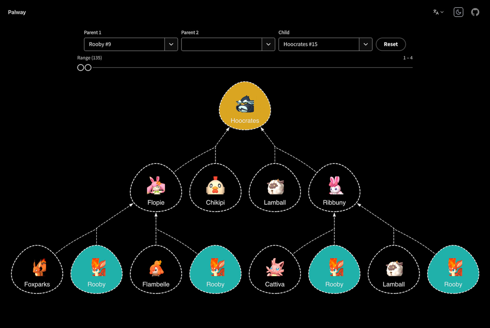

# Palway

[](https://github.com/ambar/palway/actions/workflows/test.yml)
[](https://coveralls.io/github/ambar/palway?branch=main)

Breeding calculator for Palworld.



## Develop

```sh
pnpm i
pnpm start
```

## Credits

- https://www.reddit.com/r/Palworld/comments/19d98ws/spreadsheet_all_breeding_combinations_datamined/
